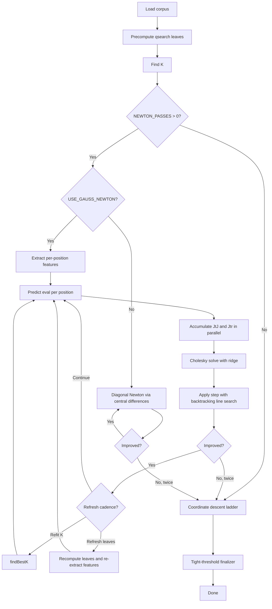

# Texel Tuning Pipeline

End-to-end pipeline for tuning the HCE evaluation: **self-play → extract →
tune**, fully drivable from `make` targets, fully detachable, and
restartable from any partial state.

## Quick start

Run the entire pipeline overnight, detached:

```bash
make texel-bg
```

That kicks off self-play (32 000 game pairs at 100 000 nodes / move,
concurrency 12), extracts qsearch leaves, and runs the tuner on 14
threads. The tuner does up to 10 Gauss-Newton initial passes (cheap,
quadratically convergent, single Cholesky solve per pass) and then
falls through to up to 30 coordinate-descent passes for the residual;
K is refit every 4 passes and leaves are refreshed every 8 passes
throughout. Logs go to `tuning/texel/pipeline.log`; the live tuner
checkpoint lands at `tuning/checkpoint.txt`.

When the run finishes, fold the tuned values into the source tree:

```bash
make texel-apply       # rewrites src/eval_params.cpp
git diff src/eval_params.cpp
git commit ...         # if you like what you see
```

## Make targets

| Target | What it does |
|---|---|
| `make texel` | Run the full pipeline in the foreground. Useful for short experiments where you want to watch the log. |
| `make texel-bg` | Same as `texel` but detached via `nohup`. Survives a closed shell. Writes `tuning/texel/pipeline.pid`. |
| `make texel-stop` | Send SIGTERM to the pipeline tree (orchestrator + self-play + extractor + tuner), wait briefly, then SIGKILL anything that survived. Sweeps orphan `build/tune` / `fastchess` / extractor processes pinned to `tuning/texel/`. |
| `make texel-status` | Show the orchestrator PID and elapsed time, every active worker, the current self-play / extract / tune progress lines, and the size and modification time of every artifact. |
| `make texel-dump` | Print the current tuned snapshot (from `tuning/checkpoint.txt`) as a `kDefaultEvalParams` literal. Read-only — does not modify any source file. |
| `make texel-apply` | Replace the `kDefaultEvalParams` block in `src/eval_params.cpp` with the dumped snapshot. Does **not** commit; review with `git diff` and commit yourself. |
| `make texel-selfplay` | Run only the self-play stage. |
| `make texel-extract` | Run only the extract stage. |
| `make texel-tune` | Run only the tune stage. |

All targets that touch the engine or tuner depend on `build/rlngin` and
`build/tune`; the Makefile rebuilds them on demand.

## Configuration

Every knob is overridable on the command line as a make variable:

| Variable | Default | Used by |
|---|---|---|
| `ROUNDS` | `32000` | self-play game pairs (= `2 * ROUNDS` games) |
| `LIMIT` | `nodes=100000` | per-move budget. Either a Cute-Chess tc string like `1+0.08` or a literal `nodes=N`. |
| `CONCURRENCY` | `12` | self-play parallel games |
| `TUNE_THREADS` | `14` | tuner worker threads |
| `TUNE_PASSES` | `30` | coordinate-descent passes |

Examples:

```bash
# Quick smoke run: 4k pairs at 1+0.08, 5 tune passes
make texel-bg ROUNDS=4000 LIMIT=1+0.08 TUNE_PASSES=5

# Resume from an existing checkpoint
FROM_CHECKPOINT=tuning/texel/checkpoint.txt make texel-tune

# Force a fresh self-play run (deletes nothing automatically; just
# overrides the skip-if-exists check inside the pipeline)
FORCE=1 make texel-bg
```

Lower-level settings live in environment variables:

| Env var | Default | Stage |
|---|---|---|
| `OUTPUT` | `tuning/texel` | all stages |
| `ENGINE` | `./build/rlngin` | self-play |
| `TUNE` | `./build/tune` | tune, dump, apply |
| `OPENINGS` | `openings/UHO_Lichess_4852_v1.epd` | self-play |
| `SKIP_PLIES` | `8` | extract |
| `TAIL_PLIES` | `2` | extract |
| `REFIT_K_EVERY` | `4` | tune |
| `REFRESH_LEAVES_EVERY` | `8` | tune |
| `NEWTON_PASSES` | `10` | tune (set `0` for legacy CD-only behavior) |
| `USE_GAUSS_NEWTON` | `1` | tune (set `0` to fall back to diagonal Newton via finite differences) |
| `FROM_CHECKPOINT` | unset | tune (resume) |
| `WAIT_PID` | unset | pipeline (block until external PID exits before starting) |
| `FORCE` | `0` | pipeline (set `1` to redo every stage) |
| `POLL_SECS` | `30` | pipeline (PID polling cadence) |
| `CHECKPOINT` | `tuning/checkpoint.txt` | dump, apply |

## Tuner phases

The tuner runs in two phases by default:

1. **Gauss-Newton initial phase** (up to `NEWTON_PASSES`, default 10).
   The driver extracts a per-position sparse linearization feature
   vector once over the corpus by perturbing each parameter and
   recording its post-taper effect on the eval, then every iteration
   is a single parallel pass that accumulates the normal equations
   `J^T J` (778x778) and `J^T r` (778), followed by a Cholesky solve
   with a small ridge (`1e-3 * trace(J^T J) / P`) for numerical
   safety. The Newton update is applied with backtracking at scales
   `[1.0, 0.5, 0.25]`; per-parameter steps are clipped to +/-32 cp
   for robustness. The phase exits when two consecutive iterations
   fail to clear the threaded-noise threshold (`bestLoss * 1e-7`).
   Set `USE_GAUSS_NEWTON=0` to fall back to **diagonal Newton** (per-
   parameter central finite differences on the loss, no feature
   cache); both flavors share the same `NEWTON_PASSES` budget and
   the same K refit / leaf refresh cadences.
2. **Coordinate descent fallback** (up to `TUNE_PASSES`, default 30).
   The classical Texel ladder `[8, 4, 2, 1]` per scalar, accept-only
   on strict improvement, with the same K refit and leaf refresh
   cadences and a tighter (`1e-8`) deterministic finalizer at the
   end.

Cost comparison per pass on the 5.4M-position corpus, 14 threads:

| Method | Per-pass cost | Notes |
|---|---|---|
| Coordinate descent ladder | ~40 minutes | `~8P` exact loss evals |
| Diagonal Newton | ~10 minutes | `2P + 3` exact loss evals |
| Gauss-Newton | ~4 seconds | Single corpus pass plus Cholesky solve, plus 1-3 exact loss evals for line search; one-time `~5 minute` feature extraction at start and after each leaf refresh |

Gauss-Newton's quadratic convergence near a smooth optimum tends to
absorb most of the available signal in a handful of iterations.
Coordinate descent then picks up the residual that does not project
cleanly onto a diagonal-plus-correlation Hessian. Set
`NEWTON_PASSES=0` to reproduce the legacy CD-only behavior bit-for-bit.



## Pipeline behavior

The pipeline is **resumable**. Each stage skips if its output artifact
already exists:

| Stage | Output | Skip predicate |
|---|---|---|
| self-play | `tuning/texel/games.pgn` | `[ -f games.pgn ]` |
| extract | `tuning/texel/positions.epd` | `[ -f positions.epd ]` |
| tune | `tuning/texel/checkpoint.txt` (archive) | always runs |

Set `FORCE=1` to ignore the skip checks and rerun everything. Tune always
runs — to resume from the live checkpoint pass `FROM_CHECKPOINT=...` to
the tune script.

If self-play crashes mid-run, just rerun `make texel-bg`; extract and
tune will pick up from the partial PGN. (fastchess writes the PGN
incrementally and recovers from per-game crashes via the `-recover`
flag.) For a clean restart, delete the PGN: `rm tuning/texel/games.pgn`.

## Detachment guarantees

`make texel-bg` launches via `nohup` with stdin closed and stdout / stderr
redirected to `tuning/texel/pipeline.log`. The orchestrator PID is
written to `tuning/texel/pipeline.pid` so `make texel-stop` can find and
kill the entire process tree even after the launching shell is gone.

The kill walks the process tree under that PID, sends SIGTERM, waits up
to three seconds, then SIGKILLs any survivors. After the tree kill it
sweeps `pgrep -f` for any orphan `build/tune`, `fastchess`, or extractor
processes whose command line mentions `tuning/texel/` — that catches the
case where a wrapper script was killed but its child got reparented to
`PID 1`.

## Artifacts

| File | Stage | Purpose |
|---|---|---|
| `tuning/texel/games.pgn` | self-play | full self-play corpus |
| `tuning/texel/positions.epd` | extract | qsearch-leaf labeled positions |
| `tuning/texel/checkpoint.txt` | tune | archived final checkpoint |
| `tuning/checkpoint.txt` | tune (live) | live tuner checkpoint, written between passes |
| `tuning/texel/selfplay.log` | self-play | per-game results |
| `tuning/texel/extract.log` | extract | extractor output |
| `tuning/texel/tune.log` | tune | per-pass loss and parameter moves |
| `tuning/texel/pipeline.log` | orchestrator | stage-level timestamps |
| `tuning/texel/pipeline.pid` | orchestrator | live orchestrator PID for stop / status |

## Applying tuned values

Two-step workflow:

```bash
make texel-dump            # preview the snapshot (stdout)
make texel-apply           # rewrite src/eval_params.cpp in place
git diff src/eval_params.cpp
git add src/eval_params.cpp
git commit
```

`texel-apply` calls `./build/tune --dump tuning/checkpoint.txt` and
splices the resulting `kDefaultEvalParams` literal into the source file.
It does not commit, run tests, or rebuild — review the diff yourself.

## Troubleshooting

**Pipeline running but not making progress.** Check
`make texel-status`. If self-play started long ago and `Started game`
hasn't advanced, fastchess may be stuck on a hung engine — `make
texel-stop` and rerun. For tune, check `tuning/texel/tune.log`; if loss
isn't decreasing past pass 5 or so, re-extract the corpus
(`rm tuning/texel/positions.epd && make texel-extract`).

**`texel-stop` says nothing is running but workers persist.** Run
`pgrep -af build/tune` and `pgrep -af fastchess`. If anything shows up,
something else launched them; `kill` them by PID.

**Tuner exited with no checkpoint archive.** Look at the tail of
`tuning/texel/tune.log`. If it died during the qsearch-leaf precompute
phase, the live `tuning/checkpoint.txt` won't have been updated and
`make texel-apply` will dump the previous run's values. Either:
1. Rerun: `FROM_CHECKPOINT=tuning/checkpoint.txt make texel-tune`
2. Or delete the stale checkpoint and start fresh:
   `rm tuning/checkpoint.txt && make texel-tune`

**Want to start a brand-new tune from compiled-in defaults.** Delete the
checkpoint and run tune without `FROM_CHECKPOINT`:
```bash
rm -f tuning/checkpoint.txt tuning/texel/checkpoint.txt
make texel-tune
```
